# 🎬 Bhowanee Prototype — 3 to 4-Minute Video Walkthrough Script

**Platform:** Bhowanee (Unified Agricultural Commerce & Fintech Ecosystem)  
**Target Runtime:** 3:30 – 4:00 Minutes  
**Video Purpose:** Investor Pitch, Product Demonstration, Stakeholder Onboarding  
**Core Tagline:** *"Let's celebrate agriculture together."*  
**Date:** September 2026  

---

## 📋 Pre-Recording Setup Checklist

| Item | Recommendation | Done |
|:---|:---|:---:|
| **Display Resolution** | 1920 × 1080 (16:9 1080p). Avoid ultra-wide cropping. | [ ] |
| **Browser Zoom** | 100% or 110% for crisp, legible typography on charts and cards. | [ ] |
| **Local / Live URL** | `http://localhost:3000/index.html` or live GitHub Pages URL. | [ ] |
| **Audio Setup** | Quiet room, clear microphone, 120–135 words per minute pacing. | [ ] |
| **Cursor Highlighting** | Enable yellow/blue click halo in your screen recorder (OBS / Loom). | [ ] |
| **Browser Tabs Setup** | Open each role dashboard in pre-loaded tabs (optional shortcut). | [ ] |

---

## ⏱️ Video Structure & Pacing

```mermaid
gantt
    title Bhowanee 4-Minute Walkthrough Timeline
    dateFormat  s
    axisFormat  %M:%S
    section Intro
    Sign-in & 10s Ecosystem Story : 0, 40
    section Production
    Farmer Portal (Ask Price & Bids) : 40, 75
    Block Administrator (Cadastral GIS) : 75, 110
    section Market & Supply
    Institutional Buyer (Pre-Orders & Auction) : 110, 150
    Logistics (Fleet & Route Opt) : 150, 180
    Storage & Warehouse (Cold Chain) : 180, 205
    section Governance
    Investor Analytics & Control Room : 205, 225
    section Close
    Conclusion & Platform Vision : 225, 240
```

---

## 🎬 Step-by-Step Script

---

### **Scene 1: Introduction & The 10-Second Ecosystem Story (0:00 – 0:40)**
* **Page:** [`index.html`](file:///c:/Users/mohit/OneDrive/Documents/Bhowanee/index.html) *(Sign-in Page)*

| Screen Action & Visual Cues | Spoken Voiceover (Word-for-Word) |
|:---|:---|
| Start with the sign-in card centered cleanly on screen.  Gently hover your cursor over the **Bhowanee** circular logo and the tagline: *"Let's celebrate agriculture together."* | *"Welcome to Bhowanee — a unified agricultural commerce and fintech ecosystem built to transform India's farming value chain from harvest to escrow settlement."* |
| Move cursor to the animated canvas on the left panel. Allow the camera to follow the **10-second master animation cycle** as it plays: 1. Farmer Prakash & IoT telemetry beacon 2. Logistics truck driving to the warehouse 3. Cloud exchange board deploying pre-orders & matching bids 4. Golden rupee coins flowing back to the celebrating farmer.  Point to the **4-step synchronized narrative stepper** underneath lighting up in sequence: `1. Farm & Direct Price` → `2. Fleet & Cold Storage` → `3. Pre-Orders & Bids` → `4. Direct Escrow Payout`. | *"Right here on our sign-in page, our 10-second live ecosystem animation tells the complete story: Indian farmers setting their own fair prices, GPS-routed fleet pickup, modern cold storage preservation, institutional buyer pre-orders and competitive bidding, and instantaneous 100% direct escrow payouts with zero middleman exploitation."* |
| Click the language buttons at the top right: click **मराठी**, click **हिन्दी**, then click back to **English**. | *"The platform is built natively for India, featuring instant regional localization in Marathi, Hindi, and English, with secure role-based portals for every participant in the agri-chain."* |

---

### **Scene 2: The Farmer Portal – Pricing & Guaranteed Sale (0:40 – 1:15)**
* **Page:** [`farmer.html`](file:///c:/Users/mohit/OneDrive/Documents/Bhowanee/farmer.html) *(Click **Farmer** on sign-in)*

| Screen Action & Visual Cues | Spoken Voiceover (Word-for-Word) |
|:---|:---|
| Land on the **Sell** tab for farmer Prakash Sonawane.  Point cursor to the **Lot Meta** (*Onion · 12 quintal · Grade A · Gat 118*) and the live **Today's mandi price** reference card (*₹1,880*). | *"Let's first enter the Farmer Portal. Meet Prakash Sonawane from Dindori, Nashik. Instead of being forced into distress selling at local mandis, Prakash sees today's mandi reference rate of ₹1,880, but retains full sovereign control over his valuation."* |
| Click the `+10` stepper button twice to set the price to **₹2,100**. Click the blue **"Set my price"** button. Point to the green confirmation message. | *"Using an intuitive stepper, he sets his ask price to ₹2,100 per quintal and locks it into the Bhowanee system."* |
| In the left navigation, click the **Offers** tab.  Show the **Live Bid Graph** displaying ascending buyer bids over time.  Hover over the top bid (`₹2,100` from Fresh Mart) and click **"Accept offer"**. Point to the closed lot alert. | *"Moving to the Offers tab, Prakash has full transparency into live bids coming from institutional buyers. When a buyer matches his ₹2,100 ask price, he simply clicks Accept. The lot closes instantly, locking the buyer's funds in escrow."* |

---

### **Scene 3: Block Administrator – Cadastral Land Mapping (1:15 – 1:50)**
* **Page:** [`block.html`](file:///c:/Users/mohit/OneDrive/Documents/Bhowanee/block.html) *(Sign out / select **Block administrator**)*

| Screen Action & Visual Cues | Spoken Voiceover (Word-for-Word) |
|:---|:---|
| Land on the **Dindori Block Admin** dashboard.  Pan across the interactive **Leaflet Cadastral Map**, showing color-coded land parcels (Gat numbers 118, 123, 125, 128, 129). | *"Behind every verified harvest is the Block Administrator. In Dindori, our local administrator oversees agricultural parcels using digitized GIS cadastral mapping."* |
| Click on a parcel on the map (Gat 125 – Prakash's land). The right drawer opens showing farmer details, crop stage, and task list.  Scroll down through tasks (*Sowing, Irrigation, Fertiliser, Harvest*) and cost tracking. | *"Admins monitor every farmer's Gat land record, soil moisture telemetry, and sowing schedule. By verifying tasks like irrigation and fertilizer on-site, Bhowanee ensures institutional buyers receive certified Grade-A commodities with 100% land traceability."* |

---

### **Scene 4: Institutional Buyer – Pre-Orders & Live Bidding (1:50 – 2:30)**
* **Page:** [`buyer.html`](file:///c:/Users/mohit/OneDrive/Documents/Bhowanee/buyer.html) *(Sign out / select **Buyer**)*

| Screen Action & Visual Cues | Spoken Voiceover (Word-for-Word) |
|:---|:---|
| Land on **Browse Lots** for Fresh Mart Supply Co.  Point to the KPI cards: *Lots Available*, *Total Volume (20.0 Qt)*, and *100% Lab Quality Tested*. Filter by commodity (*Onion*) and grade (*Grade A*). | *"Now let's switch to the Institutional Buyer portal, utilized by FMCG brands, food processors, and large APMC merchants like Fresh Mart Supply Co."* |
| Click **Demand Planner** and then **Live Bid Board** in the sidenav.  Emphasize the core Bhowanee workflow: Pre-orders are fulfilled first; remaining excess enters the live auction. | *"Our buyer workflow solves a major industry problem: Seasonal demand is registered in advance through Forward Pre-Orders. When harvest arrives, verified volumes deploy to advance pre-orders first. Any excess produce then enters the Live Bid Board for real-time competitive bidding."* |
| Click the **Delivery Tracker** tab.  Point to the 4-step delivery timeline: `1. Farm Gate Picked` → `2. In Transit` → `3. Staged at Dindori Cold Store` → `4. Buyer Delivery`. | *"Once closed, buyers track dock delivery in real time across four verifiable milestones, backed by automated escrow accounts that release payment only upon certified dock weigh-in."* |

---

### **Scene 5: Logistics Partner – Fleet & Route Optimization (2:30 – 3:00)**
* **Page:** [`logistics.html`](file:///c:/Users/mohit/OneDrive/Documents/Bhowanee/logistics.html) *(Sign out / select **Logistics Partner**)*

| Screen Action & Visual Cues | Spoken Voiceover (Word-for-Word) |
|:---|:---|
| Land on the **Vehicle Fleet** dashboard.  Scroll down to show the multi-vehicle listing (Truck 1, Truck 2, capacities, and active GPS status badges). | *"Farm-to-fork reliability requires dedicated supply chain logistics. In the Logistics Partner portal, fleet operators register multiple transport vehicles with verified tonnage capacities."* |
| Click **Route Allotment & Schedule** in the sidenav.  Highlight the route timeline (e.g. 25th September pickup, 30th delivery) and the green **Route Optimization** badge. | *"Bhowanee's route optimization engine groups multi-farm gate pickups into scheduled collection corridors. This minimizes empty transit miles, guarantees prompt farm-gate collection, and prevents post-harvest transit loss."* |

---

### **Scene 6: Storage & Warehouse Partner (3:00 – 3:25)**
* **Page:** [`storage.html`](file:///c:/Users/mohit/OneDrive/Documents/Bhowanee/storage.html) *(Sign out / select **Storage & Warehouse**)*

| Screen Action & Visual Cues | Spoken Voiceover (Word-for-Word) |
|:---|:---|
| Land on **My Facilities & Capacity**.  Show the facility card with real-time temperature telemetry (`❄️ 2°C Optimal`), humidity indicators, and storage utilization progress bars. | *"To combat crop perishability, our Storage & Warehouse portal allows cold storage operators to list verified holding capacity, humidity zones, and temperature specs."* |
| Point to the **Physical Verification by Bhowanee** stepper and click **Storage Orders** to show electronic warehouse receipts (e-NWR). | *"Facilities undergo physical verification by Bhowanee field auditors. Once verified, warehouses receive automated inbound storage orders, turning harvest into collateralized, grade-preserved inventory."* |

---

### **Scene 7: Investor Analytics & Super Admin Control (3:25 – 3:45)**
* **Page:** [`investor.html`](file:///c:/Users/mohit/OneDrive/Documents/Bhowanee/investor.html) & [`admin.html`](file:///c:/Users/mohit/OneDrive/Documents/Bhowanee/admin.html)

| Screen Action & Visual Cues | Spoken Voiceover (Word-for-Word) |
|:---|:---|
| In `investor.html`, scroll past the interactive portfolio return charts, profit metrics, and block risk distribution. | *"For capital partners, the Investor portal offers transparent yield tracking, funding farm inputs and cold chain infrastructure with structured, risk-mitigated returns."* |
| In `admin.html`, briefly show the platform-wide control room: active contracts, total transaction velocity, escrow balances, and block health. | *"And finally, the Bhowanee Control Room monitors platform-wide contract velocity, escrow balances, and block health in real time."* |

---

### **Scene 8: Conclusion & Platform Vision (3:45 – 4:00)**
* **Page:** [`index.html`](file:///c:/Users/mohit/OneDrive/Documents/Bhowanee/index.html) *(Return to Sign-in Page)*

| Screen Action & Visual Cues | Spoken Voiceover (Word-for-Word) |
|:---|:---|
| Return to the sign-in page with the full card in view.  Let the camera linger on the celebrating farmer animation and the Bhowanee title. | *"By connecting the farmer, the administrator, the buyer, logistics, storage, and investors into a single trusted loop, Bhowanee removes middlemen, guarantees fair value, and brings financial dignity to rural agriculture."* |
| Hover cursor over the tagline: *"Let's celebrate agriculture together."* | *"Thank you for watching — let's celebrate agriculture together!"* |

---

## 💡 Practical Recording Tips

1. **Pre-Open Browser Tabs (Recommended Strategy):**  
   To keep your video completely seamless without having to type phone numbers or OTPs during recording, open each dashboard in advance in adjacent browser tabs:
   - **Tab 1:** `index.html` (Sign-in Page)
   - **Tab 2:** `farmer.html` (Farmer Prakash)
   - **Tab 3:** `block.html` (Dindori Block Admin)
   - **Tab 4:** `buyer.html` (Fresh Mart Buyer)
   - **Tab 5:** `logistics.html` (Fleet Operations)
   - **Tab 6:** `storage.html` (Storage & Warehouse)
   - **Tab 7:** `investor.html` / `admin.html` (Investor & Admin)  
   *Use `Ctrl + Tab` or mouse clicks to switch smoothly between tabs as you speak.*

2. **Pacing & Breath:**  
   Allow 1 full second after navigating to a page before speaking. This gives viewers a moment to visually absorb the dashboard before hearing your explanation.

3. **Mouse Movement:**  
   Move the mouse with intention. Hover directly over the numbers and buttons you mention (e.g. Mandi price, Ask price, Route optimization badge, Temperature display) to direct the viewer's eye.

---
*Document saved in project root as `VIDEO_WALKTHROUGH_SCRIPT.md`.*
